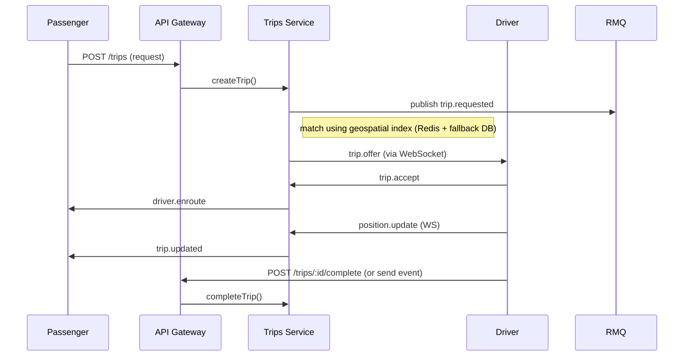

# API Specification — MoveGo

## Principais convenções

- Base URL: `/api/v1`
- Autenticação: `Authorization: Bearer <access_token>` (JWT)
- Refresh tokens: `POST /auth/refresh` com `refresh_token` no corpo; refresh tokens são armazenados no servidor e podem ser revogados.
- `Idempotency-Key` header obrigatório para endpoints de criação sensíveis (`POST /trips`, `POST /payments/charge`).
- Padrão de resposta: `{"data": ..., "meta": ..., "error": ...}`
- Paginação padrão: `?page=<n>&per_page=<m>` com `meta` contendo `total,page,per_page,next_page,prev_page`. Endpoints de alta taxa suportam cursor-based pagination quando indicado.

## Endpoints de Autenticação (Auth Service)

### POST /auth/register
- Body: `{"email","phone","password","name"}`
- Response: `201 {"data":{"user_id":..., "verification_required": true|false}}`

### POST /auth/login
- Body: `{"email_or_phone","password"}`
- Response: `200 {"data":{"access_token","refresh_token","expires_in"}}`

### POST /auth/refresh
- Body: `{"refresh_token"}`
- Response: `200 {"data":{"access_token","refresh_token"}}`

### POST /auth/oauth
- Body: `{provider, token}`
- Response: `200 {user, tokens}`

### POST /auth/password-reset-request
### POST /auth/password-reset

## Users

### GET /users/me
- Auth: required
- Response: `200 {"data":{user}}`

### PUT /users/me
- Auth: required
- Body: fields to update (`name`, `photo_url`, `metadata`)

### GET /users/:id
- Admin: can view full record

## Drivers

### POST /drivers/apply
- Body: driver profile, docs, vehicle
- Response: `201` pending approval

### GET /drivers/:id
- Public view: `id, user_id, status, online, rating, vehicle` (vehicle joined)

### PATCH /drivers/:id/status
- Admin endpoints to approve/block drivers

### POST /drivers/:id/availability
- Body: `{ "online": boolean, "lat"?: number, "lng"?: number }` — updates `drivers.online` and (optionally) publishes location to real-time layer

### GET /drivers/nearby?lat=&lng=&radius_m=&limit=
- Returns list of online drivers ordered by distance. Primary source: Redis geospatial index; fallback: DB `driver_current_locations` GIST index.

### Driver Current Location (snapshot store)

The primary store for real-time driver positions is Redis (pub/sub, geospatial index). The DB table `driver_current_locations` is a low-frequency snapshot/fallback and is not intended for high-rate writes.

### GET /drivers/{id}/location
- Returns latest known location snapshot for driver (from DB fallback). Prefer Redis for live queries.

### POST /driver_current_locations
- Internal/ingestion endpoint (trusted): accepts `{ "driver_id": uuid, "location": { "lat", "lng" }, "updated_at": iso }` and upserts into `driver_current_locations`. Use for periodic snapshots or worker snapshots.

### GET /driver_current_locations/nearby?lat=&lng=&radius_m=&limit=
- Admin/internal endpoint to query DB fallback for nearby drivers. Prefer `GET /drivers/nearby` which uses live Redis data.

## Trips (Trips Service)

### POST /trips
- Idempotent: require header `Idempotency-Key`
- Body: `{passenger_id, pickup:{lat,lng}, dropoff:{lat,lng}, scheduled_at?, payment_method?, coupon_code?, metadata?}`
- Server computes `fare_cents` estimate and creates `trips` with `status=requested`.
- Response: `201 {"data":{"trip_id","status":"requested","fare_cents":int}}`

### GET /trips/:id
- Returns trip including `route` (GeoJSON), `fare_cents`, `commission_cents`, `start_time`, `end_time`, `distance_meters`, `duration_seconds`, `status`, `passenger_id`, `driver_id`.

### POST /trips/:id/accept
- Driver accepts: body `{ "driver_id": uuid }` — sets `driver_id` and `status=accepted`.

### POST /trips/:id/start
- Sets `status=in_progress` and `start_time`

### POST /trips/:id/complete
- Sets `status=completed`, `end_time`, computes `fare_cents`, and triggers payment flow (creates `payments` row or calls `POST /payments/charge`).

### POST /trips/:id/cancel
- Body: `{ "actor_id": uuid, "reason": string }` — sets `status=cancelled`

### GET /trips?status=&passenger_id=&driver_id=&page=&per_page=&from=&to=&sort_by=&order=
- Pagination and filtering for passenger history, driver history and admin.

## Trip Tracking & Locations

- WebSocket preferred for high-frequency position updates. REST fallback: `POST /trips/:id/locations` to write to `trip_locations` (partitioned by `recorded_at`).

### POST /trips/:id/locations
- Body: `{ lat, lng, timestamp, type }` or GeoJSON `Point` — writes to partitioned `trip_locations` table. Recommend batching via RMQ for heavy loads.

### GET /trips/:id/locations?page=&per_page=
- Paginated history (cursor-based recommended for large series).

## Real-time

- WebSocket endpoint: `/ws` (via API Gateway) — authenticate with access token in query param or initial message
- Events (server/client):
  - Client -> Server: `trip.request`, `position.update`, `trip.cancel.request`
  - Server -> Driver: `trip.offer` (id, fare_estimate, eta)
  - Driver -> Server: `trip.accept`
  - Server -> Passenger: `driver.enroute`, `driver.arrived`, `trip.started`, `trip.updated` (position), `trip.completed`, `trip.cancelled`

Sequence diagram (simplified):



## Payments (Billing Service)

### POST /payments/charge
- Header: `Idempotency-Key` required
- Body: `{ trip_id, user_id, amount_cents, currency, provider }`
- Behavior: creates `payments` row (status pending), calls provider, updates `payments.status` on webhook
- Response: `202 Accepted` (async)

### GET /payments/:id
- Returns payment status and `provider_payment_id`

### Webhooks
- `POST /webhooks/stripe` — verify signature, update payment status

## Wallets & Wallet Transactions

### GET /wallets/{user_id}
- Returns wallet and current `balance_cents`

### POST /wallets/{user_id}/transfer
- Body: `{ amount_cents, type: debit|credit, reference_id?, metadata? }` — creates `wallet_transactions` and updates `wallets.balance_cents` in a transaction

### GET /wallets/{user_id}/transactions
- Paginated list of `wallet_transactions` with filters: `type`, `from`, `to`, `reference_id`

### POST /wallets/{user_id}/transactions
- Internal/admin: create transaction on behalf of user; must be protected. Use for refunds, adjustments.

## Coupons & Coupon Usages

### GET /coupons/:code
- Returns coupon details (code, type, amount, expires_at, usage_limit)

### POST /coupons/{id}/use
- Body: `{ user_id, payment_id? }` — creates `coupon_usages` if usage not exceeded

### GET /coupon_usages?user_id=&coupon_id=&page=
- Paginated list

## Notifications

### GET /notifications?user_id=&unread_only=&page=
- Returns notifications for user, paginated

### POST /notifications
- Admin only: enqueue notification (creates `notifications`)

### POST /notifications/{id}/mark-read
- Marks `notifications.read = true`

## Ratings

### POST /trips/{id}/ratings
- Body: `{ rater_id, ratee_id, score, comment }` — creates `ratings` row

## Audit Logs

### GET /audit_logs?entity=&entity_id=&actor_id=&page=
- Admin-only, read-only; append-only store `audit_logs`

### POST /audit_logs
- Internal only: create audit entry (action, entity, before, after)

### Marking and access
- `GET /audit_logs` — Admin-only read endpoint; POST is internal-only and must be protected. Audit logs are append-only.

## Refresh Tokens & Idempotency Keys

### GET /refresh_tokens?user_id=&active_only=
- Admin-only

### POST /refresh_tokens/revoke
- Body: `{ token_id }` — revokes a refresh token (sets `revoked=true`)

### POST /idempotency_keys
- Body: `{ key }` — registers key server-side; unique constraint enforced

## Constraints, Indices & DB-level rules (exposed to API designers)

- `users.email` is `citext` unique
- `drivers.cpf` unique
- `ratings.score` CHECK (1..5)
- `payments.amount_cents >= 0`
- `wallets.user_id` UNIQUE
- `payments.idempotency_key` UNIQUE (partial index when not null)
- `trip_locations` partitioned by `recorded_at` (RANGE) and indexed with GIST on `location`
- `driver_current_locations` GIST index on `location` for proximity search

## HTTP codes and error contract

- 200 OK — successful GET/POST for idempotent updates
- 201 Created — resource created
- 202 Accepted — async processing started (e.g., payment initiated)
- 204 No Content — successful delete/no body
- 400 Bad Request — validation error
- 401 Unauthorized — missing/invalid token
- 403 Forbidden — RBAC or policy rejection
- 404 Not Found — resource missing
- 409 Conflict — idempotency key collision or business conflict
- 422 Unprocessable Entity — semantic validation
- 500 Internal Server Error — unexpected

Error body example:
```
{ "error": { "code": "validation_failed", "message": "email is required", "details": { "email": "required" } } }
```

## Pagination, Filtering, Sorting

- Pagination query: `?page=1&per_page=25` (defaults `per_page=25`, max 100)
- Filtering: query params (e.g., `/trips?status=completed&from=2026-01-01&to=2026-02-01&passenger_id=...`)
- Sorting: `?sort_by=created_at&order=desc` (default `desc` for time-series)

## Idempotency and Concurrency

- `POST /trips` and `POST /payments/charge` require `Idempotency-Key` header. API stores key in `idempotency_keys` and enforces uniqueness. On duplicate key, return `409 Conflict` with previous response reference.
- Wallet transfers and balance updates must be transactional and use `wallet_transactions` ledger to ensure consistency; use SELECT FOR UPDATE on wallet row when updating.

## Versioning and Backwards Compatibility

- Version in path: `/api/v1`. Breaking changes must move to `/api/v2`. API must include `Deprecation` header for soon-to-be-removed fields.

## Observability and Tracing

- All endpoints must emit traces and metrics. Use `X-Request-ID` header propagated across services.

## Checklist de validação cruzada (DB ⇄ API)

1. Every table has corresponding resource endpoints or internal-only endpoints documented (`users`, `drivers`, `vehicles`, `trips`, `trip_locations`, `payments`, `wallets`, `wallet_transactions`, `ratings`, `coupons`, `coupon_usages`, `notifications`, `audit_logs`, `refresh_tokens`, `idempotency_keys`).
2. Field names and types in API payloads match DB columns (e.g., `fare_cents` integer in API and DB).
3. Constraints documented (unique, CHECKs) and API returns 409/422 accordingly.
4. Indices used by query endpoints are listed (geospatial indexes, composite indexes for filtering/sorting).
5. Endpoints that require transactions/locks are documented (wallet updates, payments reconciliation).
6. Idempotency keys: header usage and storage behavior documented.
7. Partitioning strategy for `trip_locations` is noted and API provides batched retrieval (pagination by recorded_at cursor).
8. Audit logs are write-only via system operations and exposed read-only to admins.

## Notas e observações

- Recomenda-se gerar OpenAPI/Swagger automaticamente a partir desta especificação e dos modelos de DTOs no backend (NestJS) para evitar divergência.
- Para endpoints de alta taxa (position updates), preferir WebSocket or ingestion via Kafka/RMQ + worker aggregation instead de chamadas REST diretas ao banco.
-
-*** End of file - replaced per update ***