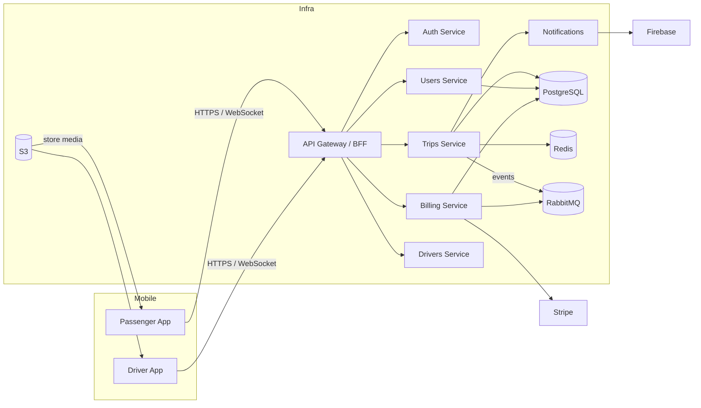

# Arquitetura do MoveGo

## Visão Geral

MoveGo é uma plataforma de mobilidade urbana que conecta passageiros e motoristas em tempo real. A arquitetura proposta é orientada a serviços, escalável, resiliente e observável, composta por os seguintes blocos principais:

- Mobile Passenger App (Flutter)
- Mobile Driver App (Flutter)
- Backend (NestJS, TypeScript) dividido por domínios / microserviços
  - API Gateway / BFF
  - Auth Service
  - Trips Service (real-time + domain)
  - Billing & Payments Service
  - Users Service
  - Drivers Service
  - Notifications Service
  - Admin API / Panel
- Real-time layer (WebSocket / Socket.IO / gRPC streaming)
- Database (PostgreSQL primary, read-replicas)
- Cache (Redis)
- Message Broker (RabbitMQ)
- Object Storage (S3-compatible)
- Observability: Prometheus, Grafana, Loki
- CI/CD: GitHub Actions

A arquitetura aplica Clean Architecture e DDD no backend: cada serviço encapsula domínio, aplicação e infraestrutura.

## Componentes e responsabilidades

- API Gateway / BFF
  - Autenticação e verificação de tokens
  - Rate limiting, canary routing, request aggregation
  - Roteamento para serviços internos

- Auth Service
  - Gerencia JWT, refresh tokens, sessão e OAuth providers (Google, Apple)
  - Endpoints de login, cadastro, recuperação de senha

- Trips Service
  - Orquestra o ciclo de uma corrida (matching, dispatch, tracking)
  - Publica eventos via RabbitMQ (trip.started, trip.completed)
  - Fornece endpoints REST e WebSocket para updates em tempo real

- Billing & Payments
  - Integra com Stripe e gateways locais (PIX)
  - Calcula tarifas, comissões, comissão da plataforma e liquida pagamentos

- Notifications
  - Enfileira e envia notificações push (Firebase) e SMS (Twilio)

- Admin Panel
  - Next.js app comunicando com Admin API para operações de gestão

## Diagrama de alto nível

## Padrões arquiteturais adotados

- Clean Architecture: separação clara de camadas (domain, application, infra)
- DDD: entidades, agregados e bounded contexts (Users, Drivers, Trips, Billing)
- Event-driven: RabbitMQ para comunicação assíncrona entre serviços
- CQRS (quando justificável): leitura via read-replicas + materialized views em Redis
- Horizontal scaling: serviços estateless em containers

## Real-time

O tracking de posição e updates de corrida devem usar WebSocket (Socket.IO) com fallback para long-polling. Para maior escala, considerar uma camada de pub/sub (Redis Streams ou NATS) e múltiplas instâncias de gateway de WebSocket.

## Persistência e consistência

- PostgreSQL é a fonte da verdade para transações críticas (corridas, pagamentos).
- Redis para caches de consulta, sessões e dados temporários (estado online do motorista, geohash para busca de drivers).
- Eventual consistency para sincronizar leituras que podem tolerar latência (estatísticas, dashboards)

## Observabilidade

- Métricas: Prometheus
- Dashboards: Grafana
- Logs estruturados: Loki
- Tracing: Jaeger (opcional)

## Segurança e compliance (visão geral)

- Comunicação TLS em todos os pontos
- JWT + Refresh Tokens
- RBAC no Admin
- Criptografia de dados sensíveis em repouso (AES-256)
- Conformidade LGPD: retenção mínima de dados, direitos do usuário

## Riscos técnicos e gargalos

1. Geolocalização em tempo real: tráfego de alta frequência por usuário gera alta carga.
   - Mitigação: agregação de updates, compressão, limitar taxa (throttling), usar binning/geohash.
2. Matching e dispatch em pico: alta concorrência ao buscar drivers.
   - Mitigação: algoritmos aproximados, pré-indexação de drivers por célula geográfica, circuit-breakers.
3. Banco de dados relacional centralizado: contenda em picos para writes (corridas, pagamentos).
   - Mitigação: particionamento (sharding) por região, filas para writes não críticas, batched writes.
4. Consistência financeira: falhas durante pagamento/confirmação podem causar diferências.
   - Mitigação: transações ACID, retries idempotentes, reconciliation job noturno.
5. Escala de WebSocket: conexões persistentes são memórias e CPU consumidoras.
   - Mitigação: usar proxies/gateways especializados (kube + HPA), autoscaling por conexões, offload via managed services.
6. Dependência de terceiros (Google Maps, Stripe, Firebase, Twilio): falhas externas afetam usabilidade.
   - Mitigação: circuit breakers, degrade graceful (ex: fallback para OpenStreetMap), limitar chamadas, cache de respostas.
7. Compliance e segurança de dados: vazamento pode ter impacto legal.
   - Mitigação: auditoria, segmentation, DLP, secrets management.

## Dependências externas críticas

- Google Maps / OpenStreetMap (routing, geocoding)
- Stripe (payments)
- Firebase (push notifications, optional auth)
- Twilio (SMS)
- S3-compatible storage (AWS S3)

## Próximos passos documentados

- Modelar banco de dados e diagramas ER ([database.md](database.md))
- Especificar APIs REST e realtime ([api-specification.md](api-specification.md))
- Definir políticas de segurança detalhadas ([security.md](security.md))
- Especificar Docker/Kubernetes e pipeline de deploy ([deployment.md](deployment.md))
- Gerar roadmap e backlog ([roadmap.md](roadmap.md), [tasks.md](tasks.md))
