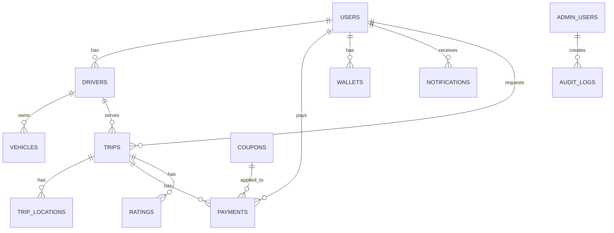

# Banco de Dados — MoveGo

## Objetivos do modelo

- Garantir integridade de dados para corridas e pagamentos
- Permitir consultas eficientes para matching e histórico
- Suportar escalabilidade horizontal e particionamento por região

## Principais entidades e campos

### users
- id (uuid, PK)
- email (varchar, unique)
- phone (varchar, unique)
- password_hash (varchar)
- name (varchar)
- photo_url (varchar)
- created_at (timestamp)
- updated_at (timestamp)
- metadata (jsonb)

### drivers
- id (uuid, PK)
- user_id (uuid, FK -> users.id)
- cpf (varchar, unique)
- cnh_number (varchar)
- vehicle_id (uuid, FK -> vehicles.id)
- status (enum: pending, approved, blocked)
- online (boolean)
- rating (numeric(3,2))
- created_at, updated_at

### vehicles
- id (uuid, PK)
- driver_id (uuid, FK -> drivers.id)
- plate (varchar)
- model (varchar)
- color (varchar)
- year (int)
- document_url (varchar)

### trips
- id (uuid, PK)
- passenger_id (uuid, FK -> users.id)
- driver_id (uuid, FK -> drivers.id, nullable)
- status (enum: requested, accepted, enroute, in_progress, completed, cancelled)
- fare_amount (money)
- commission_amount (money)
- start_time (timestamp)
- end_time (timestamp)
- distance_meters (int)
- duration_seconds (int)
- route (geometry / geojson)
- created_at, updated_at

### trip_locations
- id (uuid, PK)
- trip_id (uuid, FK -> trips.id)
- lat (numeric)
- lng (numeric)
- timestamp (timestamp)
- type (enum: pickup, dropoff, waypoint, ping)

### payments
- id (uuid, PK)
- trip_id (uuid, FK -> trips.id, nullable)
- user_id (uuid, FK -> users.id)
- amount (money)
- currency (varchar)
- status (enum: pending, succeeded, failed, refunded)
- provider (enum: stripe, pix, wallet)
- provider_payment_id (varchar)
- created_at, updated_at

### wallets
- id (uuid, PK)
- user_id (uuid, FK -> users.id)
- balance_cents (bigint)
- currency
- updated_at

### ratings
- id (uuid, PK)
- trip_id (uuid, FK -> trips.id)
- rater_id (uuid, FK -> users.id)
- ratee_id (uuid, FK -> users.id)
- score (int)
- comment (text)
- created_at

### coupons
- id (uuid, PK)
- code (varchar, unique)
- type (enum: percent, fixed)
- amount (numeric)
- expires_at (timestamp)
- usage_limit (int)
- created_at

### notifications
- id (uuid)
- user_id (uuid)
- type (varchar)
- payload (jsonb)
- read (boolean)
- created_at

### audit_logs
- id (uuid)
- actor_id (uuid)
- action (varchar)
- entity (varchar)
- entity_id (uuid)
- before (jsonb)
- after (jsonb)
- created_at

### admin_users
- id (uuid)
- email
- password_hash
- role (enum: superadmin, admin, support)
- created_at

## Relacionamentos (ER)

## Índices e otimizações

- Índice geoespacial em `drivers`/`online` usando PostGIS / geohash para busca de proximidade
- Índice composto em `trips(status, created_at)` para queries de filas e dashboards
- Índice em `payments(status, created_at)` para reconciliação
- Particionamento de `trips` por data ou por região para reduzir contenda
- Read replicas para consultas analíticas
- Materialized views para relatórios de faturamento

## Estratégias de escalonamento

- Read replicas + caching (Redis)
- Particionamento / sharding por região
- Escritas assíncronas para ops não-críticas (logs, analytics)
- Jobs de reconciliation e deduplicação

## Consistência e transações

- Transações ACID para operações financeiras e alteração de estado crítico de `trips`.
- Idempotência usando `idempotency_key` para endpoints de pagamento.

## Retenção e GDPR/LGPD

- Políticas de retenção configuráveis por entidade (logs, trip_locations)
- Endpoint para exportar/excluir dados pessoais

## Observações finais

Este modelo é um ponto de partida — normalização e ajustes serão necessários durante implementação e prototipagem. Particular atenção para índices geoespaciais e tamanho da tabela `trip_locations` (pode crescer muito rápido).