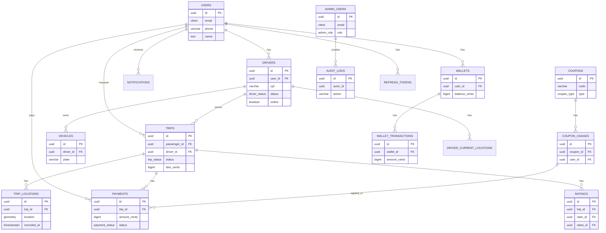

# Diagrama ER — MoveGo

```mermaid
erDiagram
    USERS ||--o{ DRIVERS : has
    USERS ||--o{ PAYMENTS : pays
    USERS ||--o{ WALLETS : has
    USERS ||--o{ NOTIFICATIONS : receives
    USERS ||--o{ TRIPS : requests
    DRIVERS ||--o{ VEHICLES : owns
    DRIVERS ||--o{ TRIPS : serves
    TRIPS ||--o{ TRIP_LOCATIONS : has
    TRIPS ||--o{ PAYMENTS : has
    TRIPS ||--o{ RATINGS : has
    COUPONS ||--o{ COUPON_USAGES : has
    COUPON_USAGES ||--o{ PAYMENTS : applied_to
    WALLETS ||--o{ WALLET_TRANSACTIONS : has
    ADMIN_USERS ||--o{ AUDIT_LOGS : creates
    USERS ||--o{ REFRESH_TOKENS : has
    DRIVERS ||--o{ DRIVER_CURRENT_LOCATIONS : has

    USERS {
      uuid id PK
      citext email
      varchar phone
      text name
    }
    DRIVERS {
      uuid id PK
      uuid user_id FK
      varchar cpf
      driver_status status
      boolean online
    }
    VEHICLES {
      uuid id PK
      uuid driver_id FK
      varchar plate
    }
    TRIPS {
      uuid id PK
      uuid passenger_id FK
      uuid driver_id FK
      trip_status status
      bigint fare_cents
    }
    TRIP_LOCATIONS {
      uuid id PK
      uuid trip_id FK
      geometry location
      timestamptz recorded_at
    }
    PAYMENTS {
      uuid id PK
      uuid trip_id FK
      bigint amount_cents
      payment_status status
    }
    WALLETS {
      uuid id PK
      uuid user_id FK
      bigint balance_cents
    }
    WALLET_TRANSACTIONS {
      uuid id PK
      uuid wallet_id FK
      bigint amount_cents
    }
    COUPONS {
      uuid id PK
      varchar code
      coupon_type type
    }
    COUPON_USAGES {
      uuid id PK
      uuid coupon_id FK
      uuid user_id FK
    }
    RATINGS {
      uuid id PK
      uuid trip_id FK
      uuid rater_id FK
      uuid ratee_id FK
    }
    ADMIN_USERS {
      uuid id PK
      citext email
      admin_role role
    }
    AUDIT_LOGS {
      uuid id PK
      uuid actor_id
      varchar action
    }
```